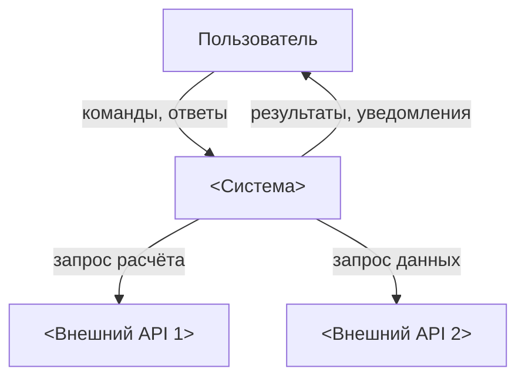
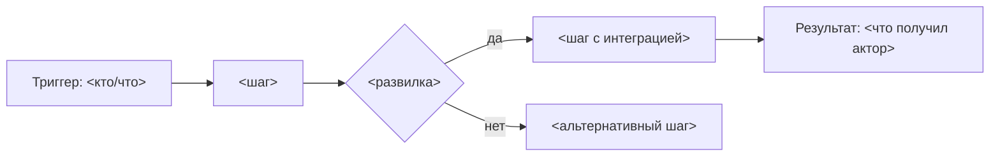
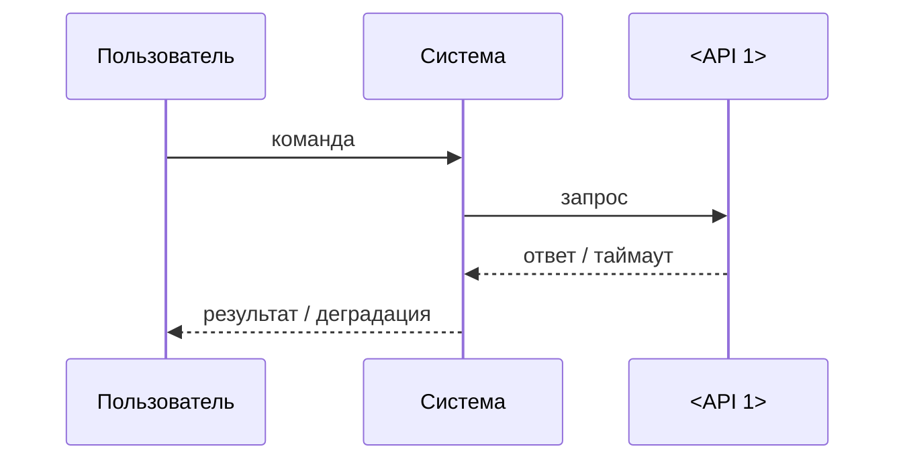
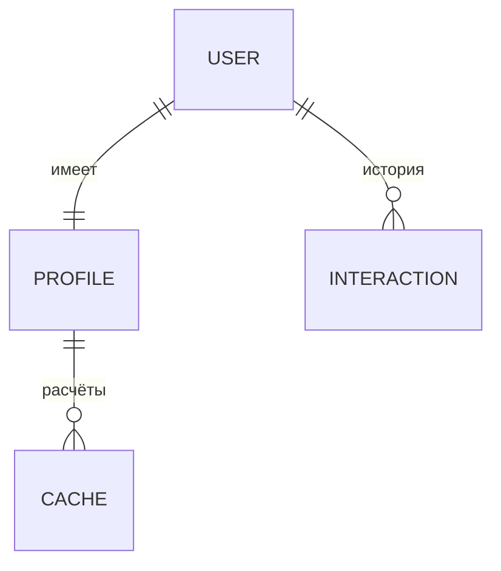

# <Название проекта> — продукт и процессы

> Продукт и процессы языком бизнеса, не модулей кода. **Схема первична, текст — подпись:** секция
> открывается mermaid-диаграммой, абзац говорит только то, чего схема не покажет — зачем так, чем
> ограничено, что при отказе. Чисел и порогов нет — они в `QUICK_REF`.
> Цитату удалить, курсив — примеры; пустые секции удалить, «TBD» не оставлять.

---

## Продукт

*3–5 предложений: для кого продукт, какую боль решает, что является результатом. Без маркетинга.*

*Пример: Telegram-бот ежедневных персональных советов. Пользователь один раз заполняет профиль — дальше каждый день получает совет, собранный из расчётов, погоды и новостей его региона.*

## Контекст и акторы

*Границы системы: кто и что с ней взаимодействует, какие данные пересекают границу (C4 L1).*

*Строка на актора — кто это и что делает. Пример: Пользователь — владелец профиля, получает советы; Владелец — оперирует ботом, правит промпты.*

## Процессы

*Ядро документа. `###`-подсекция на каждый бизнес-процесс: flowchart + триггер, результат, деградация.*

### <Процесс 1: имя>

- **Триггер:** *команда пользователя / расписание / событие.*
- **Результат:** *что получает актор в конце.*
- **Деградация:** *что видит пользователь при сбое каждой участвующей интеграции.*

## Интеграции

*С кем интегрированы и зачем. Sequence-диаграмма — для обменов, где важны порядок и тайминги.*

| Система | Зачем бизнесу | Какие данные ходят | При сбое |
|---|---|---|---|
| *<API 1>* | *расчёт X* | *→ параметры; ← результат* | *процесс останавливается, пользователь видит ошибку* |
| *<API 2>* | *данные Y* | *→ город; ← прогноз* | *результат собирается без Y, с пометкой* |

## Данные

*Сущности в бизнес-терминах: что храним, зачем, сколько живёт. ER — карта, не DDL (DDL — в коде).*

| Сущность | Что это | Время жизни |
|---|---|---|
| *`users` / `profiles`* | *кто пользователь и его данные для расчётов* | *навсегда* |
| *`*_cache`* | *результаты внешних вызовов* | *часы–день* |

*Опция для сложного жизненного цикла сущности — `stateDiagram-v2`; источник правды по статусам и условиям переходов — `QUICK_REF.md`, здесь только визуализация.*

## Tech stack

| Слой | Технология |
|---|---|
| *Язык* | *Python 3.12* |
| *БД* | *SQLite / PostgreSQL* |
| *Деплой* | *Docker* |
