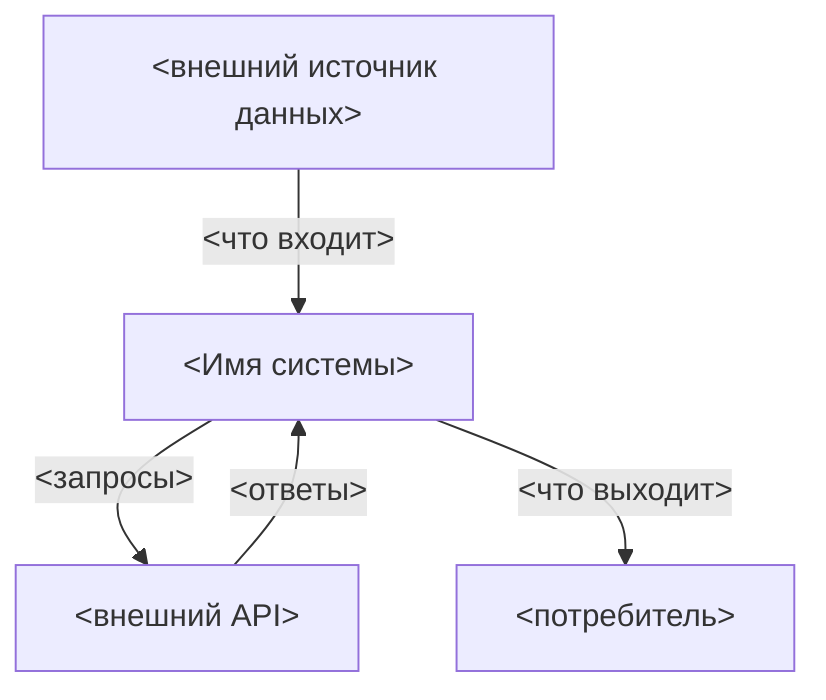
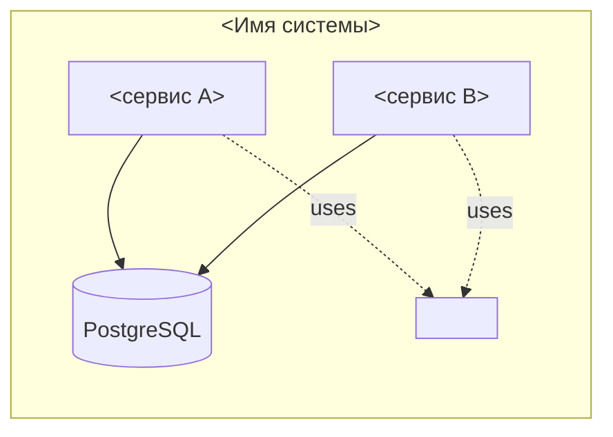
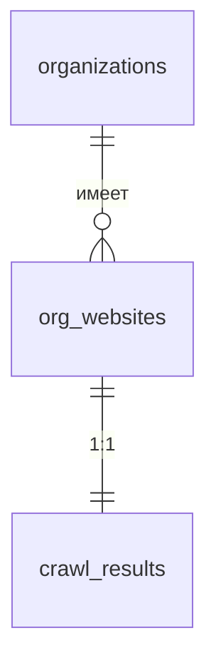

# Architecture Overview — <Название проекта>

> Стандарт: C4 Model (Level 1 — System Context, Level 2 — Container)
> Методология: Diátaxis / Explanation — фокус на «почему», а не «что».
>
> **Шаблон.** Удалить этот блок-цитату и заполнить секции под свой проект. Пустые секции — удалить, не оставлять «TBD».

---

## Бизнес-задача

*2–4 предложения: что делает система, для кого, какую ценность даёт.*

*Пример:*

*Автоматическое обогащение реестра юридических лиц технологическим стеком и контактами без ручного аудита сайтов. Входные данные: массив организаций. Выходные данные: Parquet-датасет с верифицированным сайтом, tech stack, контактами и LLM-суммаризацией деятельности. Ключевая ценность: B2B-сегментация рынка по технологическому профилю.*

---

## C4 Level 1 — System Context

*Что находится снаружи системы и какие данные пересекают её границу.*

---

## C4 Level 2 — Containers

*Внутренняя структура системы. Контейнер ≠ Docker-контейнер — это любой независимо деплоящийся компонент (сервис, БД, очередь, статический сайт).*

---

## Pipeline

*Если система — это data pipeline или stage-based процессинг. Описать каждую стадию: вход → что делает → выход → следующий триггер.*

### Stage N: <имя>

- **Вход:** *откуда читает (таблица + условие SELECT)*
- **Что делает:** *суть обработки в 1–2 предложениях*
- **Выход:** *что пишет (таблица + поля)*
- **Триггер следующей стадии:** *по какому флагу/статусу следующий компонент подхватит запись*

---

## Схема данных (ER)

*Ключевые таблицы и связи. Mermaid `erDiagram` или просто список таблиц с краткой ролью каждой. Полная схема — в коде (`schema.py` / DDL-файлы); здесь — карта.*

**Принципы:**
- *Один источник правды DDL: `<path/to/schema.py>`*
- *Миграции — только через `MIGRATION_STATEMENTS`, не из кода сервисов (см. `A-NN`)*
- *VIEW для read-side: `v_<name>`*

---

## Tech stack

| Слой | Технология | Где |
|---|---|---|
| *Язык* | *Python 3.12* | *все сервисы* |
| *HTTP* | *aiohttp / playwright* | *crawl-сервисы* |
| *DB* | *PostgreSQL 16* | *общая* |
| *Контейнеризация* | *Docker + docker-compose* | *prod + dev* |
| *Очередь* | *—* | *используется БД как state machine* |

---

## Cross-Cutting Concerns

*Сквозная функциональность, проходящая через все сервисы. Изменение здесь = архитектурно значимо.*

### Обработка ошибок
*Где живёт классификация ошибок, какие коды, кто их пишет, кто читает.*

### Retry-стратегия
*Где задаются `MAX_ATTEMPTS`, `RETRY_AFTER`, backoff. Один шаблон или разные у каждого сервиса?*

### Heartbeat / healthcheck
*Как сервис сигналит «живой». Где конфиг docker healthcheck. Autoheal?*

### Логирование
*Формат, уровни, где собирается.*

### Конфигурация
*Какие env vars обязательны, где валидируются (`_require_env`), где живут пороги.*

---

## Описание модулей

*Краткое описание ключевых модулей `shared/` и сервисов: что экспортирует, кто использует.*

### `shared/<module>.py`

- **Экспортирует:** *функции/классы*
- **Используют:** *сервисы X, Y, Z*
- **Изменение API** → обновить этот раздел + затронутые сервисы за один коммит
